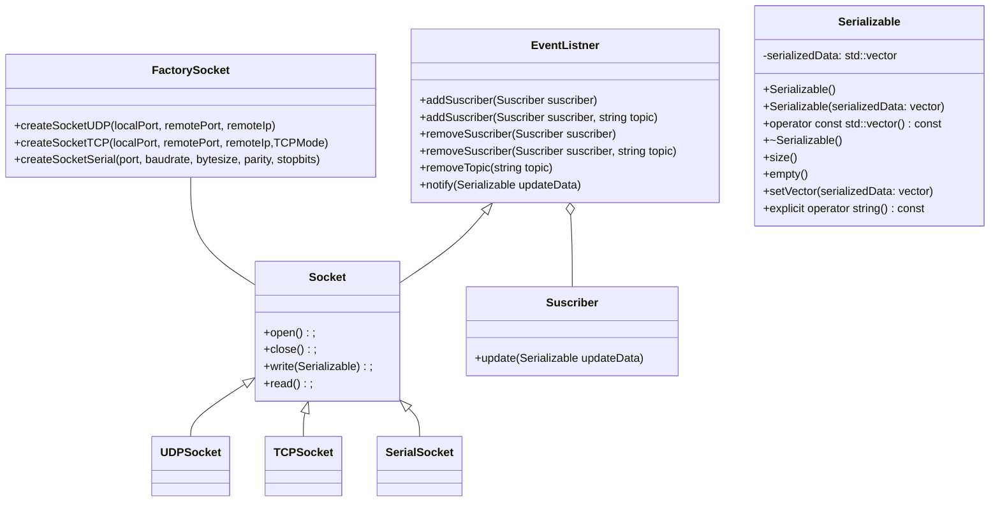

### Socket
This module is in charge of the communication between sockets. It is divided in three parts: UDP, TCP and Serial. 

```mermaid
classDiagram 
Socket <|-- UDPSocket
Socket <|-- TCPSocket
Socket <|-- SerialSocket
EventListner <|-- Socket
EventListner o-- Suscriber
FactorySocket --  Socket

class FactorySocket{
    +createSocketUDP(localPort, remotePort, remoteIp)
    +createSocketTCP(localPort, remotePort, remoteIp,TCPMode)
    +createSocketSerial(port, baudrate, bytesize, parity, stopbits)
}

class Socket{
    +open();
    +close();
    +write(Serializable);
    +read();
}

class Serializable {
    +Serializable()
    +Serializable(serializedData: vector<bytes>)
    +operator const std::vector<bytes>() const
    +~Serializable()
    +size()
    +empty()
    -serializedData: std::vector<bytes>
    +setVector(serializedData: vector<bytes>)
    +explicit operator string() const
}

class Suscriber{
    +update(Serializable updateData)
}

class EventListner{
    +addSuscriber(Suscriber suscriber)
    +addSuscriber(Suscriber suscriber, string topic)
    +removeSuscriber(Suscriber suscriber)
    +removeSuscriber(Suscriber suscriber, string topic)
    +removeTopic(string topic)
    +notify(Serializable updateData)
}

```
